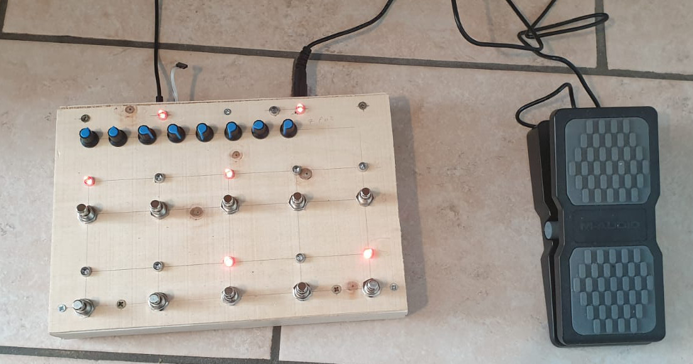
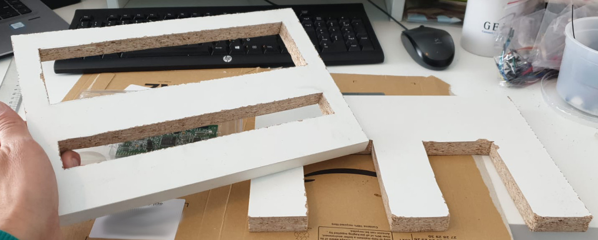
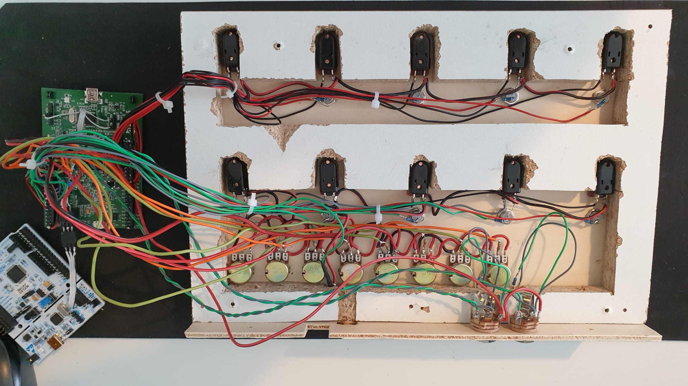

# MidiPedalBoard

## Overview

This repository contains a USB Midi Pedal board based on a STM32F407G-DISC1 with 10 buttons, 8 potentiometers and 2 expression pedals

It is USB MIDI class-compliant, so you can add MIDI port without drivers(Windows, iOS, Android, etc...)

The USB-MIDI Class Driver is based on [mimuz-tuch](https://github.com/mimuz/mimuz-tuch) project (c) [D.F.Mac. @TripArts Music](https://github.com/tadfmac).

I got great inspiration from 2 open source projects:
* [USB-MIDI Interface 8IN/8OUT for STM32 CureMIDI8] (https://github.com/keshikan/CureMIDI8)
* [Arduino MIDI Footswitch](https://github.com/Hecsall/arduino-midi-footswitch) 

## Specifications

* 10 buttons
* 8 potentiometers
* 2 expression pedals
* USB MIDI class-compliant

## Building Information

### Making hardware

See [Presentation](./Documents/STM32pedalStomps.odp)

Basically you should work some wood:

And connect about 30 wires:

### Building software

Install [STM32CubeIDE](https://www.st.com/en/development-tools/stm32cubeide.html), import [Project files](./stm32/).
When building the binary file will be created in /stm32/Debug/ or /stm32/Release/ 

## File Location

* [Binary file for STM32F407G-DISC1](./Documents/Disc407.bin)
* [STM32CubeIDE Project file](./stm32/)
* [Documentation](./Documents/STM32pedalStomps.odp)

## NOTICE

### VID/PID

Vendor ID(VID) and Product ID(PID) in <usbd_desc.c> should be unique pair for each USB devices.
Default VID 0x1209 and PID 0xDACA is experimental IDs from [http://pid.codes](http://pid.codes) .
When distributing or selling, you must get your own IDs, and change to your own IDs in order to avoid conflicting to other USB devices.

## Copyrights

* USB MIDI Class Driver by [D.F.Mac. @TripArts Music](http://ta-music.strikingly.com/)
* STM32Cube by [STMicroelectronics](https://www.st.com/en/development-tools/stm32cubeide.html)
* USB buffer libs by Keshikan (http://www.keshikan.net/)

## Author

(c) 2021 Daniele Caltabiano ( [Website](https://www.danielecaltabiano.com/) )

## License

* USB MIDI Class Driver: [CC BY 4.0](https://creativecommons.org/licenses/by/4.0/)
* STM32 CubeF4: BSD-3-Clause based.
* USB buffer libs: [GPLv3](https://www.gnu.org/licenses/gpl-3.0.html)
* Other Codes, Hardware, Schematic: [MIT](https://opensource.org/licenses/mit-license.php)

See also [LICENSE.md](./LICENSE.md)

## Update History

* (2021/05/19)
  * Initial Release.